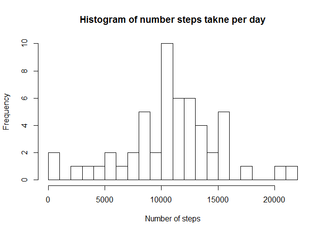
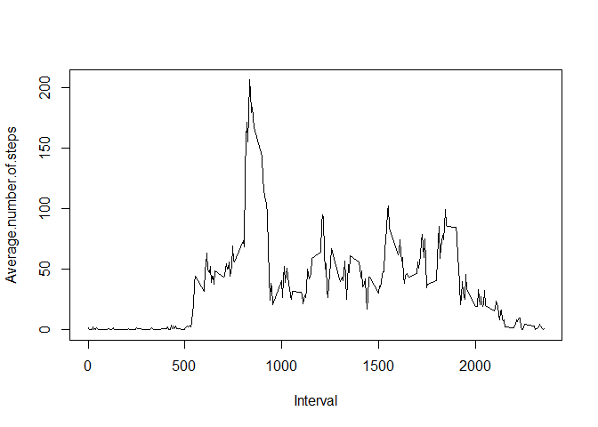
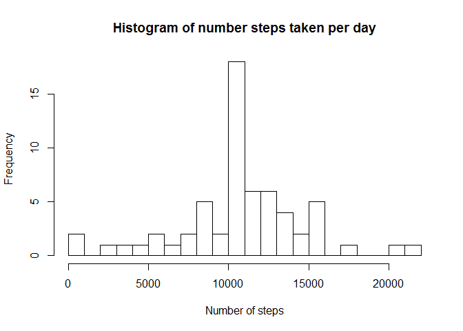
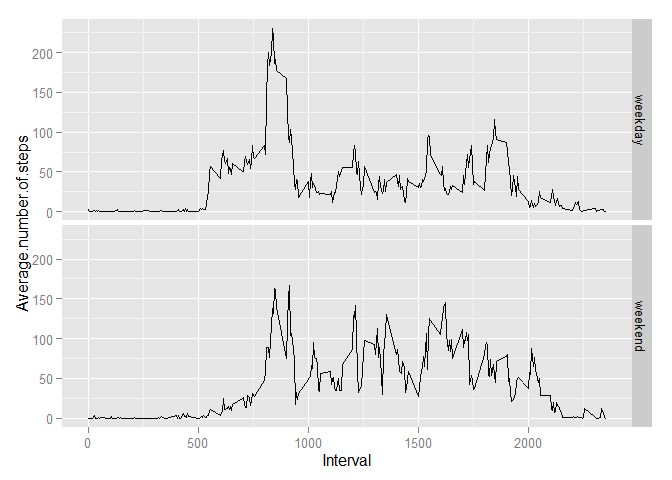

# Assignment 1
MSK80  
Monday, July 13, 2015  
##Reading Data

```r
activity <- read.csv("activity.csv")
```
Data description
The variables included in this dataset are:

- steps: Number of steps taking in a 5-minute interval (missing values are coded as NA)

- date: The date on which the measurement was taken in YYYY-MM-DD format

- interval: Identifier for the 5-minute interval in which measurement was taken

The dataset is stored in a comma-separated-value (CSV) file and there are a total of 17,568 observations in this dataset.

##Data summary

```r
activity$date <- as.Date(activity$date)
summary(activity)
```

```
##      steps             date               interval     
##  Min.   :  0.00   Min.   :2012-10-01   Min.   :   0.0  
##  1st Qu.:  0.00   1st Qu.:2012-10-16   1st Qu.: 588.8  
##  Median :  0.00   Median :2012-10-31   Median :1177.5  
##  Mean   : 37.38   Mean   :2012-10-31   Mean   :1177.5  
##  3rd Qu.: 12.00   3rd Qu.:2012-11-15   3rd Qu.:1766.2  
##  Max.   :806.00   Max.   :2012-11-30   Max.   :2355.0  
##  NA's   :2304
```


# What is mean total number of steps taken per day?

Input data contains missing values stored as NA. For further calculations they will be removed from analysis.

```r
data<-na.omit(activity)
```
Getting list of unique dates. To view how wide the data range is.

```r
dates <- data$date[!duplicated(data$date)]
dates
```

```
##  [1] "2012-10-02" "2012-10-03" "2012-10-04" "2012-10-05" "2012-10-06"
##  [6] "2012-10-07" "2012-10-09" "2012-10-10" "2012-10-11" "2012-10-12"
## [11] "2012-10-13" "2012-10-14" "2012-10-15" "2012-10-16" "2012-10-17"
## [16] "2012-10-18" "2012-10-19" "2012-10-20" "2012-10-21" "2012-10-22"
## [21] "2012-10-23" "2012-10-24" "2012-10-25" "2012-10-26" "2012-10-27"
## [26] "2012-10-28" "2012-10-29" "2012-10-30" "2012-10-31" "2012-11-02"
## [31] "2012-11-03" "2012-11-05" "2012-11-06" "2012-11-07" "2012-11-08"
## [36] "2012-11-11" "2012-11-12" "2012-11-13" "2012-11-15" "2012-11-16"
## [41] "2012-11-17" "2012-11-18" "2012-11-19" "2012-11-20" "2012-11-21"
## [46] "2012-11-22" "2012-11-23" "2012-11-24" "2012-11-25" "2012-11-26"
## [51] "2012-11-27" "2012-11-28" "2012-11-29"
```
Calculating total sum of steps made per day.

```r
p1<-aggregate(list(data$steps),by=list(data$date),FUN=sum)
colnames(p1) <- c("Date","Sum.of.Steps")
```
Creating histogram of steps per day.

```r
hist(p1[,2],breaks=25,main="Histogram of number steps takne per day",xlab="Number of steps")
```

 

Summary of data containing number steps made per day.

```r
summary(p1[,2])
```

```
##    Min. 1st Qu.  Median    Mean 3rd Qu.    Max. 
##      41    8841   10760   10770   13290   21190
```
Total mean number of steps taken per day is 10760.

Total median number of steps taken per day is 10770.

## What is average daily activity pattern?
Creating table with averaged number of steps made in every 5 minute interval.

```r
p2<-aggregate(list(data$steps),by=list(data$interval),FUN=mean)
colnames(p2) <- c("Interval","Average.number.of.steps")
```

Creating a plot to review potential daily pattern.

```r
plot(p2,type="l")
```

 

Searching for maximum number of steps in 5-minute interval.

```r
max <- max(p2[,2])
max
```

```
## [1] 206.1698
```

```r
a<-p2[p2[,2]==max,]
a
```

```
##     Interval Average.number.of.steps
## 104      835                206.1698
```
Maximum average number of steps is in interval:

```r
a[,1]
```

```
## [1] 835
```

## Missing values
Counting number of NAs.

```r
sum(is.na(activity$steps),TRUE)
```

```
## [1] 2305
```
New dataset is created in which all missing values will be filled up with average value for particular 5-minute interval.

```r
activity2<-activity
for (i in 1:length(activity$steps)) {
        if(is.na(activity[i,1])) {
                activity2[i,1] <- p2[p2[,1]==activity[i,3],2]
        }
}
```

To verify how much new dataset differs from the old one (containing NAs), histogram will be vreated.

Calculating sum of steps per day.

```r
p3<-aggregate(list(activity2$steps),by=list(activity2$date),FUN=sum)
colnames(p1) <- c("Date","Sum.of.Steps")
hist(p3[,2],breaks=25,main="Histogram of number steps taken per day",xlab="Number of steps")
```

 
Summary of steps per day:

```r
summary(p3[,2])
```

```
##    Min. 1st Qu.  Median    Mean 3rd Qu.    Max. 
##      41    9819   10770   10770   12810   21190
```
Due to simple fact, that the total number of observations is increased, histogram changes. Inserting values calculated out
of averaged values makes median value equal to median, which can prove that datapoints are normally distributed.
It can be shown by using normality test:

```r
shapiro.test(p3[,2])
```

```
## 
## 	Shapiro-Wilk normality test
## 
## data:  p3[, 2]
## W = 0.9454, p-value = 0.008739
```

##Are there differences in activity patterns between weekdays and weekends?
Creating new column in dataset containing weekday.

```r
Sys.setlocale("LC_TIME", "English")
```

```
## [1] "English_United States.1252"
```

```r
activity2$weekday <- weekdays(activity2$date)
activity2$week <- "weekday"
activity2$week[activity2$weekday=="Sunday"] <- "weekend"
activity2$week[activity2$weekday=="Saturday"] <- "weekend"
```
Creating two additional tables that separate data points recorded during weekend and weekday.

```r
data1 <- subset(activity2,week=="weekday")
data2 <- subset(activity2,week=="weekend")
```
Creating summary tables, which contain average number of steps taken per interval during weekend and weekday.

```r
p4 <- aggregate(list(data1$steps),by=list(data1$interval),FUN=mean)
colnames(p4) <- c("Interval","Average.number.of.steps")
p4$week <- "weekday"
p5 <- aggregate(list(data2$steps),by=list(data2$interval),FUN=mean)
colnames(p5) <- c("Interval","Average.number.of.steps")
p5$week <- "weekend"
data3 <- rbind(p4,p5)
```
Plot showing differences between datasets made during weekday and weekend.

```r
library(ggplot2)
```

```
## Warning: package 'ggplot2' was built under R version 3.1.3
```

```r
ggplot(data3,aes(x=Interval))+geom_line(aes(y=Average.number.of.steps))+facet_grid(week~.)
```

 

